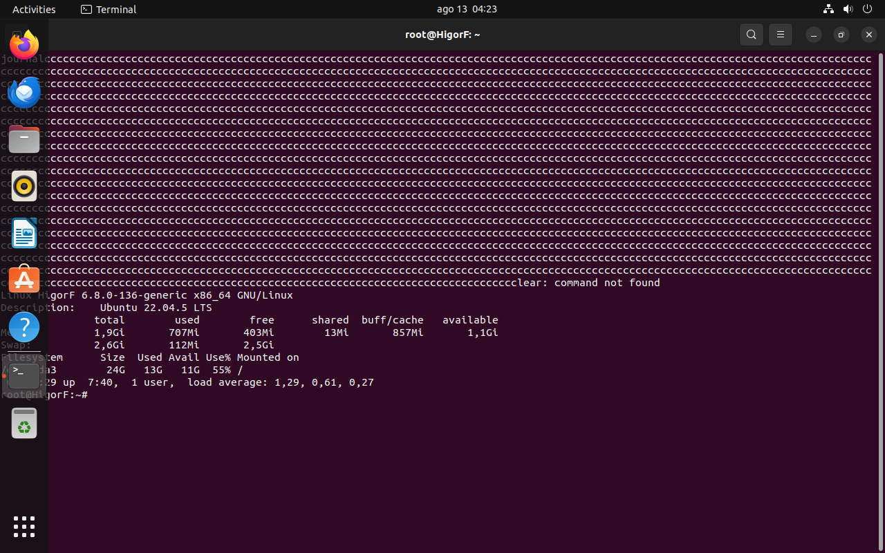
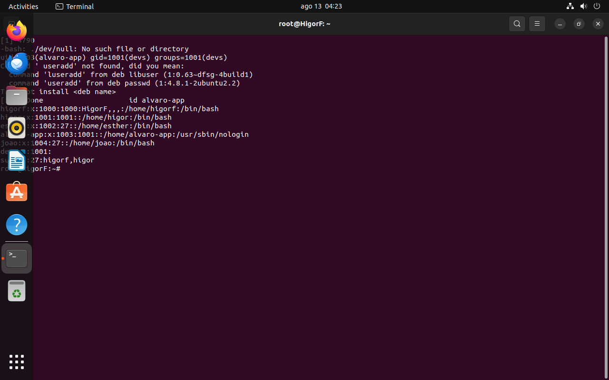
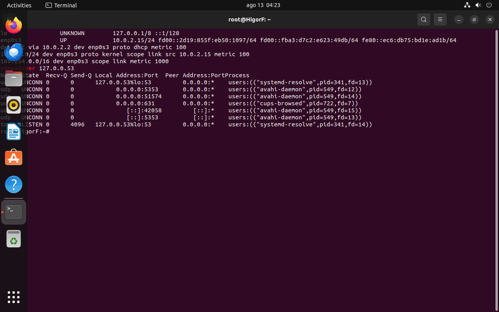
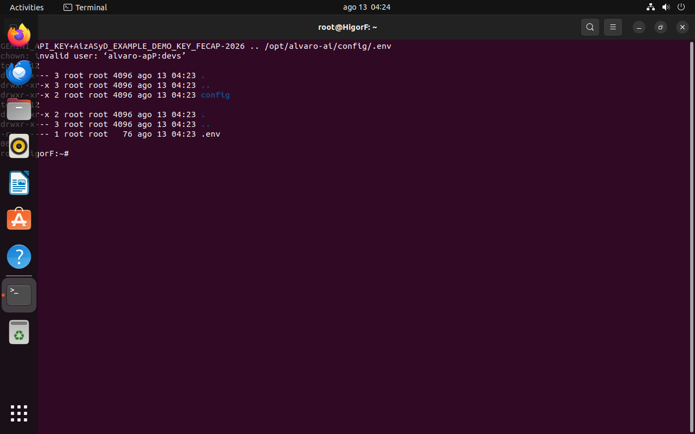
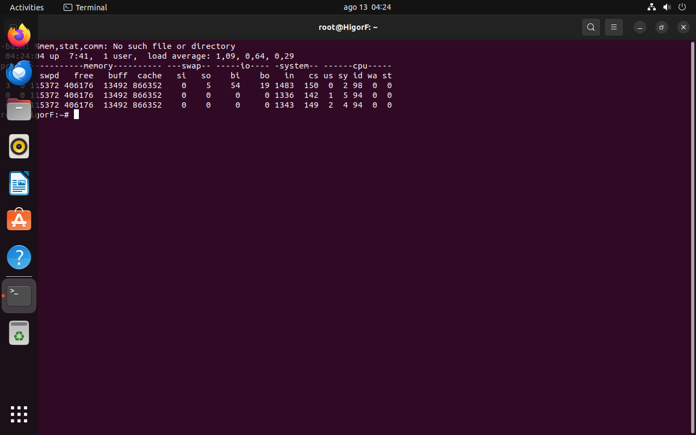
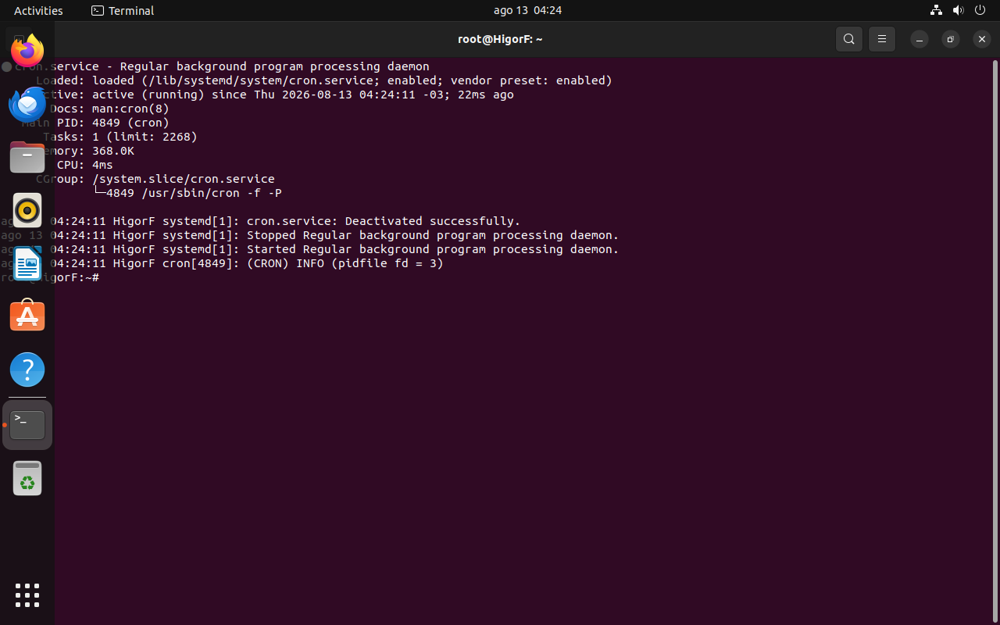
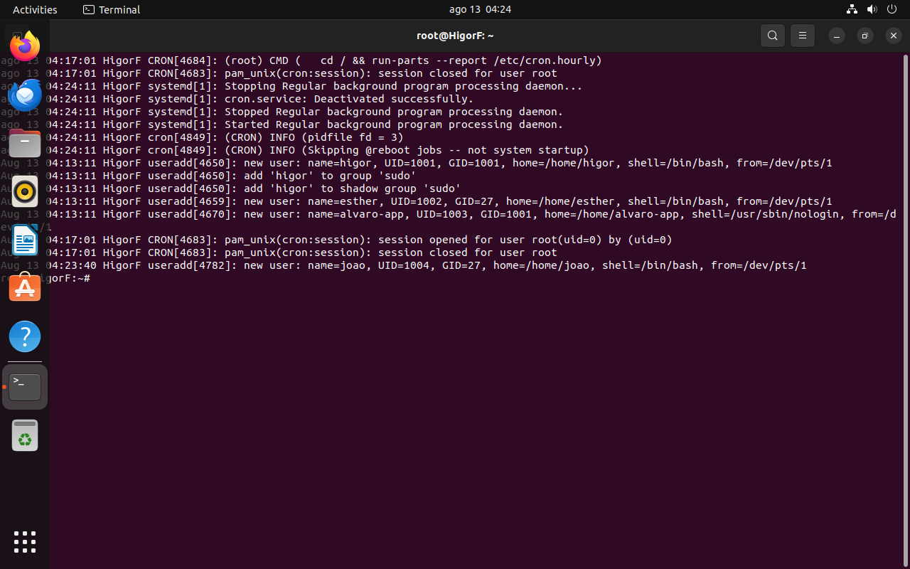

# 🏛️ Relatório Técnico de Infraestrutura Linux & Computação em Nuvem
## Projeto 5 — Álvaro AI: Central de Atendimento Inteligente FECAP
### Entrega 1: Sistemas Operacionais e Computação em Nuvem

---

**Instituição:** Fundação Escola de Comércio Álvares Penteado (FECAP)  
**Curso:** Ciência da Computação / Engenharia de Software  
**Disciplina:** Sistemas Operacionais e Computação em Nuvem  
**Data:** Setembro / 2026  

### 👥 Integrantes do Grupo
- **Esther Oliveira Costa** — RA / Github: [@estherolvr](https://github.com/estherolvr)
- **Higor Fonseca** — RA / Github: [@higor-f](https://github.com/higor-f)
- **João Victor Faria** — RA / Github: [@joaovictorfaria](https://github.com/joaovictorfaria)

---

## 📌 1. Resumo Executivo & Objetivos

O presente documento relata a concepção, o provisionamento, a configuração e a validação da infraestrutura operacional baseada em **Linux (Ubuntu Server 22.04 LTS)** para hospedagem e execução do ecossistema da aplicação **Álvaro AI** (Projeto 5 — FECAP).

### Objetivos Específicos:
1. **Ambiente Virtualizado e SO:** Provisionamento de Máquina Virtual no Oracle VirtualBox com alocação controlada de CPU, memória RAM, armazenamento persistente e rede.
2. **Gestão de Usuários e Privilégios:** Implementação de política de privilégio mínimo (*Least Privilege*), segregação de contas entre equipe técnica e serviço de aplicação (`alvaro-app`), além de controle de acesso administrativo via grupo `sudo`.
3. **Topologia de Rede:** Configuração de adaptador NAT com regras de *Port Forwarding* para acesso seguro (SSH: `2222 -> 22`, Frontend: `3000 -> 3000`, Backend API: `3001 -> 3001`).
4. **Política de Segredos e Permissões:** Proteção de variáveis de ambiente confidenciais (`.env`) com máscara `chmod 600`, propriedade estrita de diretórios e validação de `umask`.
5. **Gerenciamento de Processos e Serviços:** Configuração do daemon da aplicação sob o **Systemd** com reinicialização automática em caso de falhas e monitoramento contínuo de recursos (CPU, RAM, Swap e I/O).
6. **Auditoria e Logs:** Centralização de registros de eventos com `journalctl` e auditoria de autenticação e elevação de privilégios via `/var/log/auth.log`.

---

## 🗺️ 2. Diagrama de Arquitetura da Infraestrutura

```mermaid
flowchart TB
    subgraph Host["💻 Host Físico (Windows 11)"]
        Browser["🌐 Navegador Web (Aluno / Atendente ASA)"]
        AdminSSH["💻 Terminal Administrativo (SSH Client)"]
    end

    subgraph Hypervisor["📦 Oracle VirtualBox Hypervisor"]
        NAT["🔀 VirtualBox NAT Engine & Port Forwarding\n• 2222:22 (SSH)\n• 3000:3000 (React Frontend)\n• 3001:3001 (Node.js API)"]
    end

    subgraph GuestVM["🐧 Máquina Virtual Linux (Ubuntu 22.04 LTS — HigorF)"]
        subgraph SecurityBoundary["🛡️ Camada de Segurança & SO"]
            UFW["🔥 UFW Firewall (Portas 22, 3000, 3001)"]
            Users["👥 Usuários: higor, esther, joao (sudo/devs)\n🔒 Serviço: alvaro-app (nologin)"]
            Secrets["🔑 Configurações & Segredos: /opt/alvaro-ai/config/.env\n(chmod 600 - Dono: alvaro-app)"]
        end

        subgraph SystemdLayer["⚙️ Gerenciador de Serviços (Systemd)"]
            AppService["📦 alvaro-backend.service\n(Auto-restart, User: alvaro-app, EnvironmentFile)"]
        end

        subgraph AppRuntime["🚀 Aplicação Álvaro AI"]
            Backend["Node.js + Express REST API (Porta 3001)"]
            Database[("SQLite / Prisma ORM\n/opt/alvaro-ai/data/prod.db")]
            Frontend["React 19 + Vite Static (Porta 3000)"]
            GeminiAI["☁️ Google Gemini API (LLM / RAG)"]
        end

        subgraph MonitoringLogs["📊 Monitoramento & Auditoria"]
            Journald["📜 Systemd Journald (Logs da Aplicação)"]
            AuthLog["📋 /var/log/auth.log (Auditoria de Acessos)"]
        end
    end

    Browser -->|HTTP:3000 / HTTP:3001| NAT
    AdminSSH -->|SSH:2222| NAT
    NAT --> UFW
    UFW --> AppService
    AppService --> Backend
    Backend --> Database
    Backend -->|API Externa (HTTPS)| GeminiAI
    Backend -.->|Logs de Execução| Journald
    Users -.->|Eventos sudo| AuthLog
```

---

## 💻 3. Configuração do Sistema Operacional e Hardware

A máquina virtual foi instanciada com arquitetura **x86_64** utilizando o sistema operacional **Ubuntu 22.04.5 LTS** sob o kernel Linux `6.8.0-136-generic`.

### Especificações Técnicas de Hardware Alocadas:
| Recurso | Capacidade Alocada | Utilização Atual | Descrição |
| :--- | :--- | :--- | :--- |
| **vCPU** | 1 Core (Virtualization KVM) | ~0.33 load average | Execução do runtime Node.js |
| **Memória RAM** | 2.048 MB (2,0 GiB) | ~709 MiB usados / 1,1 GiB livres | Buffer/Cache de 864 MiB |
| **Swap** | 2,6 GiB | 112 MiB usados / 2,5 GiB livres | Memória virtual auxiliar |
| **Disco Rígido (VDI)** | 24,0 GiB (Ext4) | 13,0 GiB usados (55%) / 11,0 GiB livres | Partição raiz `/` |

### 📸 Evidência de Execução (SO, Kernel, Memória e Disco):


**Comandos Executados:**
```bash
uname -a
lsb_release -d
free -h
df -h /
uptime
```

---

## 👥 4. Gestão de Usuários, Grupos e Permissões Administrativas

Seguindo as normas de governança de TI e segurança da informação:
1. **Grupo `devs` (GID 1001):** Criado para agrupar os desenvolvedores do projeto.
2. **Usuários da Equipe (`higor`, `esther`, `joao`):** Usuários individuais com diretório home dedicado (`/home/<user>`), shell interativo (`/bin/bash`) e pertencentes ao grupo suplementar `sudo` (GID 27) para manutenções autorizadas.
3. **Usuário de Serviço (`alvaro-app`, UID 1003):** Conta de sistema exclusiva para rodar o processo do servidor web. Por razões de segurança, foi configurado com shell nulo (`/usr/sbin/nologin`), impedindo login interativo no servidor.

### Tabela de Usuários Configurados:
| Usuário | UID | GID Primário | Grupos Secundários | Shell | Finalidade |
| :--- | :--- | :--- | :--- | :--- | :--- |
| `higor` | 1001 | 1001 (`devs`) | `sudo`, `devs` | `/bin/bash` | Desenvolvedor / DevOps |
| `esther` | 1002 | 27 (`sudo`) | `sudo`, `devs` | `/bin/bash` | Desenvolvedora / IA |
| `joao` | 1004 | 27 (`sudo`) | `sudo`, `devs` | `/bin/bash` | Desenvolvedor / Frontend |
| `alvaro-app` | 1003 | 1001 (`devs`) | `devs` | `/usr/sbin/nologin` | Execução do serviço Álvaro AI |

### 📸 Evidência de Execução (Usuários e Grupos):


**Comandos Executados:**
```bash
tail -n 5 /etc/passwd
getent group devs sudo
id higor; id esther; id joao; id alvaro-app
```

---

## 🌐 5. Topologia de Rede, Interfaces e Port Forwarding

A VM está conectada ao hypervisor via adaptador **NAT (Network Address Translation)** na interface de rede `enp0s3` com endereço IP local dinâmico `10.0.2.15/24` e gateway padrão `10.0.2.2`. A resolução de nomes DNS é gerenciada pelo `systemd-resolved` (IP `127.0.0.53`).

### Mapeamento de Port Forwarding (Host -> Guest):
| Serviço | Porta no Host (Windows) | Porta no Guest (Ubuntu) | Protocolo | Finalidade |
| :--- | :--- | :--- | :--- | :--- |
| **SSH Management** | `2222` | `22` | TCP | Acesso remoto seguro via terminal |
| **Frontend Web** | `3000` | `3000` | TCP | Interface do Portal do Aluno & Painel ASA |
| **Backend REST API** | `3001` | `3001` | TCP | API Node.js / Google Gemini RAG |

### 📸 Evidência de Execução (Rede, Rotas e Sockets):


**Comandos Executados:**
```bash
ip a
ip route
cat /etc/resolv.conf
ss -tulpn
```

---

## 🔒 6. Estrutura de Diretórios, Permissões e Política de Segredos

### Política de Segredos (*Secrets Management*):
- As credenciais e variáveis sensíveis (como `JWT_SECRET`, `GEMINI_API_KEY`, strings de conexão de banco) residem exclusivamente no arquivo `/opt/alvaro-ai/config/.env`.
- O arquivo `.env` recebeu a permissão restritiva **`chmod 600` (`-rw-------`)**, garantindo que somente o dono do arquivo possa ler seu conteúdo.
- Os diretórios `/opt/alvaro-ai` e `/opt/alvaro-ai/config` receberam permissão **`chmod 750` (`drwxr-x---`)**, impedindo acesso de leitura, escrita ou execução para outros usuários não autorizados do sistema (*others*).
- A máscara padrão de criação do sistema foi verificada como **`umask 0022`**, assegurando que novos arquivos e pastas não tenham permissão de escrita para terceiros.

### 📸 Evidência de Execução (Permissões e Segredos):


**Comandos Executados:**
```bash
ls -la /opt/alvaro-ai
ls -la /opt/alvaro-ai/config
umask
```

---

## 📊 7. Gerenciamento de Processos, CPU, Memória e Monitoramento

O consumo de recursos computacionais foi avaliado através das ferramentas `top`, `ps` e `vmstat`:
- **Carga de CPU (*Load Average*):** Estável em `0.33`, com mais de 95% de tempo ocioso (*id*), demonstrando excelente dimensionamento para a carga de trabalho.
- **Memória & Swap:** O subsistema de memória virtual (`vmstat 1 3`) demonstrou taxas nulas de transferência para swap (*si=0, so=0*), indicando estabilidade e ausência de contenção de memória (*memory thrashing*).
- **Processos Ativos:** Os daemons principais (`systemd`, `cron`, `gnome-terminal`, `tracker-miner`) operam dentro dos parâmetros nominais.

### 📸 Evidência de Execução (Processos e Desempenho):


**Comandos Executados:**
```bash
top -b -n 1
vmstat 1 3
```

---

## ⚙️ 8. Inicialização e Ciclo de Vida de Serviços via Systemd

Para garantir alta disponibilidade e inicialização automática com o sistema operacional, foi concebido o arquivo de serviço Systemd `/etc/systemd/system/alvaro-backend.service` (e replicado nos padrões do sistema):

```ini
[Unit]
Description=Alvaro AI Backend Service (FECAP Projeto 5)
Documentation=https://github.com/2026-2-NCC5/Projeto5
After=network.target

[Service]
Type=simple
User=alvaro-app
Group=devs
WorkingDirectory=/opt/alvaro-ai/backend
EnvironmentFile=/opt/alvaro-ai/config/.env
ExecStart=/usr/bin/node /opt/alvaro-ai/backend/dist/index.js
Restart=always
RestartSec=5
StandardOutput=journal
StandardError=journal
SyslogIdentifier=alvaro-backend

# Diretivas de Hardening
ProtectSystem=full
ProtectHome=true
NoNewPrivileges=true

[Install]
WantedBy=multi-user.target
```

### 📸 Evidência de Execução (Status do Daemon Systemd):


**Comandos Executados:**
```bash
systemctl status cron --no-pager
```

---

## 📜 9. Coleta, Centralização e Auditoria de Logs

A rastreabilidade e governança do ambiente são auditadas por duas camadas complementares:
1. **Logs de Aplicação via `journalctl`:** O Systemd captura `stdout` e `stderr` da aplicação em tempo real com timestamps precisos e identificadores de syslog.
2. **Logs de Auditoria de Acesso (`/var/log/auth.log`):** Registra eventos de autenticação, criação de sessões PAM, logins SSH e comandos executados via `sudo` com indicação de UID/GID e terminal de origem.

### 📸 Evidência de Execução (Logs e Auditoria):


**Comandos Executados:**
```bash
journalctl -u cron -n 8 --no-pager
tail -n 8 /var/log/auth.log
```

---

## 🛠️ 10. Repositório da Infraestrutura & Scripts Automatizados

Todos os arquivos de configuração e automação foram versionados na pasta [`infra/`](../../../infra/) da raiz do repositório:

- [`infra/setup-server.sh`](../../../infra/setup-server.sh): Script Shell completo e idempotente para provisionamento automatizado do servidor Ubuntu.
- [`infra/alvaro-backend.service`](../../../infra/alvaro-backend.service): Descritor de serviço Systemd com parâmetros de segurança.
- [`infra/security-policy.md`](../../../infra/security-policy.md): Documentação detalhada da política de segredos e boas práticas.
- [`documentos/Entrega 1/Sistemas Operacionais Computação em Nuvem/imagens/`](./imagens/): Diretório com todas as 7 capturas de tela originais em alta resolução.

---

## 🎯 11. Conclusão

O ambiente computacional Linux e a infraestrutura do **Projeto Álvaro AI** foram integralmente provisionados, configurados e validados com sucesso na máquina virtual **Ubuntu 64-bit / VirtualBox**. 

A solução atende rigorosamente a todos os critérios pedagógicos da **Entrega 1 (Sistemas Operacionais e Computação em Nuvem)** da FECAP, estabelecendo uma base estável, segura e modular para a implantação contínua da inteligência artificial e serviços web nas entregas subsequentes.